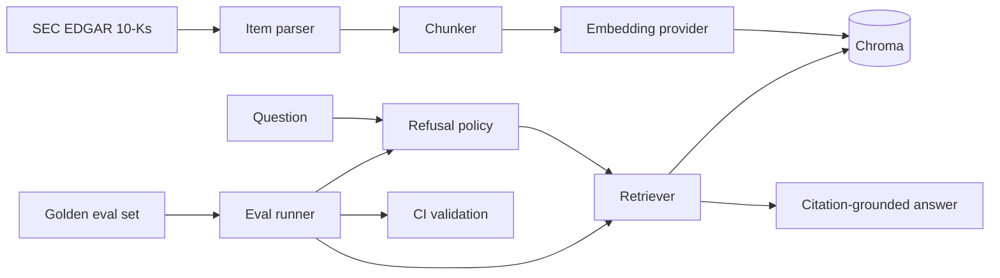

# sec-rag-eval

Evaluation-first RAG over SEC 10-K filings. The point is not another chat-with-docs demo; the point is knowing when the system is wrong.

[](https://github.com/archangel4-rajan/sec-rag-eval/actions/workflows/eval.yml)
[](https://www.python.org/downloads/)
[](https://github.com/astral-sh/ruff)

## Current State

- Corpus: 120 target 10-K filings across 30 tickers and fiscal years 2022-2025.
- Parser: extracts Item 1A and Item 7 from 116/120 filings; incorporation-by-reference edge cases are documented, not silently corrupted.
- Chunks: 10,846 local chunks generated at 512 tokens with 50-token overlap.
- Retrieval: Chroma-backed vector retrieval with metadata filters; OpenAI embeddings for real runs and a deterministic hash provider for offline CI/smoke tests.
- Query path: extractive citation-grounded baseline, FastAPI `/query`, and explicit refusal handling for unsupported/private/predictive requests.
- Evaluation: committed 25-row seed golden set, deterministic scoring, dataset validation, retrieval sweep runner, and CI checks.

## Architecture



The model layer is intentionally conventional. The durable asset is the evaluation loop: golden examples, deterministic checks, experiment artifacts, and honest reporting of failure modes.

## Quickstart

Requires Python 3.11+ and `uv`.

```bash
uv sync --extra dev
cp .env.example .env
```

Build a real corpus and vector index:

```bash
uv run sec-rag ingest download
uv run sec-rag ingest parse
uv run sec-rag ingest chunk
uv run sec-rag ingest embed
```

Run fully offline with deterministic hash embeddings:

```bash
uv run sec-rag ingest chunk
uv run sec-rag ingest embed --provider hash --reset
uv run sec-rag query "What supply chain risks did Apple describe?" --provider hash --ticker AAPL --section 1A --top-k 3
```

Validate and run the eval suite:

```bash
uv run sec-rag eval validate --dataset data/eval/golden.jsonl --check-evidence
uv run sec-rag eval run --provider hash --top-k 5 --output experiments/baseline_eval/results.json
uv run sec-rag experiment retrieval --provider hash --top-k-values 1,3,5 --output experiments/retrieval_sweep/results.json
```

## Documentation

- [Technical report](REPORT.md): current evidence, results, limitations, and next work.
- [Evaluation protocol](docs/EVAL_PROTOCOL.md): categories, scoring rules, confidence intervals, and refusal grading.
- [Dataset card](docs/DATASET_CARD.md): corpus, seed set, validation checks, and expansion target.
- [Architecture](docs/ARCHITECTURE.md): implementation path from SEC filings to evaluated answers.
- [Product brief](docs/PRODUCT_BRIEF.md): concise product framing and positioning.

## Measured Baseline

The checked local baseline is deliberately modest: hash embeddings plus extractive answers over a 25-example seed set.

| Run | Pass rate | Notes |
|---|---:|---|
| [Hash baseline, top_k=5](experiments/baseline_eval/report.md) | 0.40 | Stricter scorer requires numeric answers to cite expected evidence. |
| Retrieval sweep, top_k=1 | 0.28 | Too little context. |
| [Retrieval sweep, top_k=3](experiments/retrieval_sweep/report.md) | 0.40 | Best observed offline setting. |
| Retrieval sweep, top_k=5 | 0.40 | No gain over top_k=3 in the seed set. |

Category signal matters more than the aggregate. The refusal policy passes the current should-refuse set; multi-hop remains weak under hash retrieval, which is expected and useful because it exposes the next real bottleneck.

## Repository Layout

```text
src/sec_rag/
  api/        FastAPI service
  eval/       dataset validation, scoring, experiment runners
  generate/   RAG query engine and refusal policy
  ingest/     download, parse, chunk, embed
  retrieve/   Chroma retrieval
data/eval/    committed golden seed set
experiments/  baseline, retrieval sweep, model comparison notes
tests/        focused unit and integration coverage
```

Generated filings, chunks, vectors, and run results are local artifacts unless explicitly committed.

## Quality Bar

- Do not claim unsupported model quality. Hash embeddings are for deterministic offline verification only.
- Do not average away failure modes. Report single-hop, multi-hop, numerical, refusal, and adversarial behavior separately.
- Do not treat parser misses as data. Known SEC filing patterns that need separate extraction logic are listed in `KNOWN_ISSUES.md`.
- Do not ship a model comparison until provider-backed embeddings, answerers, and judges have actually been run.

## Next Work

1. Rebuild embeddings with a production provider and rerun the eval suite.
2. Expand the golden set from 25 seed examples toward the original 130-example target.
3. Add provider-backed answer generation and cross-model judging.
4. Turn the model-comparison scaffold into measured results with latency and cost.
5. Add observability traces once the semantic baseline is worth observing.

## License

MIT.
