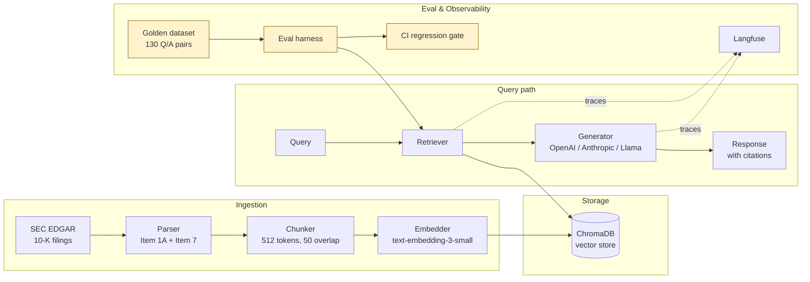

# sec-rag-eval

> An evaluation-first RAG system over SEC 10-K filings. Built around the principle that production AI quality lives or dies on the eval harness, not the model.

[](https://github.com/archangel4-rajan/sec-rag-eval/actions/workflows/eval.yml)
[](https://www.python.org/downloads/)
[](LICENSE)
[](https://github.com/astral-sh/ruff)

## About

A financial-domain Retrieval-Augmented Generation system over SEC 10-K filings, designed around a rigorous evaluation harness that catches retrieval and generation failures before they reach users. The retrieval and generation stack is intentionally conventional. The evaluation infrastructure — a hand-curated golden dataset, per-category scoring, regression CI, and observability — is the centerpiece.

Author: [Rajan Anand](https://www.linkedin.com/in/rajan-anand/) · ML/AI engineering portfolio project

## Contents

- [Why this exists](#why-this-exists)
- [Architecture](#architecture)
- [Corpus](#corpus)
- [Parsing methodology](#parsing-methodology)
- [Evaluation methodology](#evaluation-methodology)
- [Results](#results)
- [Quickstart](#quickstart)
- [Repository layout](#repository-layout)
- [Design decisions](#design-decisions)
- [Roadmap](#roadmap)
- [Limitations](#limitations)
- [License](#license)

## Why this exists

Most RAG demos answer the easy half of the question: *can you build one?* Production systems live or die on the harder half: *can you tell when it's wrong, before users do?*

This project answers the second question. The deliverables that matter:

- A hand-curated golden dataset of 130 question/answer pairs spanning factual recall, multi-hop reasoning, numerical extraction, and adversarial cases the system must refuse
- Per-category scoring across faithfulness, answer relevance, context precision/recall, hallucination rate, and refusal accuracy — broken out separately because aggregate scores hide the failure modes that matter
- A CI gate that blocks pull requests which regress quality on the eval suite
- End-to-end tracing capturing retrieval, prompts, latency, and per-query token cost
- A documented experiment log showing what was tried, what improved scores, and what was reverted

## Architecture



The eval harness, CI gate, and golden dataset (highlighted) are what differentiate this project from a typical RAG demo.

## Corpus

**120 SEC 10-K filings** spanning **30 companies** across **4 fiscal years** (2022–2025), totaling ~28K embedding-ready chunks after parsing and segmentation. Companies are selected across three sectors:

- **Technology** (10): AAPL, MSFT, NVDA, GOOGL, META, AMZN, TSLA, ORCL, CRM, ADBE
- **Industrials & Consumer** (10): CAT, DIS, LOW, PG, KO, PEP, NKE, TGT, WMT, COST
- **Financials & Health** (10): JPM, BAC, GS, C, AXP, UNH, JNJ, PFE, CVS, ABBV

Sectors are mixed deliberately so the eval can distinguish retrieval quality from parametric leakage — a model trained on the public web has strong priors on Apple but weak priors on Caterpillar, which exposes whether retrieved context actually drives answers.

Filings are sourced from SEC EDGAR via [`sec-edgar-downloader`](https://pypi.org/project/sec-edgar-downloader/). Item 1A (Risk Factors) and Item 7 (Management's Discussion & Analysis) are extracted and chunked at 512 tokens with 50-token overlap.

## Parsing methodology

10-K filings are notoriously inconsistent across filers. Building a robust parser required handling three structurally distinct filing patterns observed in the corpus:

| Pattern | Example filers | Section heading style |
|---|---|---|
| **Bold inline headings** | Apple, Google, Meta, Tesla | CSS `font-weight:700` on `<span>` wrapping "Item 1A. Risk Factors" |
| **Table-layout headings** | Amazon, Costco, Walmart | `font-weight:400` (non-bold) inside `<td>` cells |
| **Split-document submissions** | Bank of America, Morgan Stanley | Body content in a separate `<DOCUMENT TYPE="EX-13">` block, not the primary 10-K |

A regex-only parser would require a different strategy per pattern. Instead, the parser operates on plain text after a single HTML strip, scoring every "Item N" candidate by structural signals that hold across all three patterns:

- **Gap length** to the next expected section marker (real sections span 30K–300K characters; TOC entries span ~100)
- **Cross-reference detection** in a window around the candidate (phrases like *"see Item 7 of Part II"* or *"discussed in Item 1A"*)
- **Marker density** before the candidate (TOC entries cluster many Item-N markers within a few hundred characters; real headings stand alone)
- **End-marker fallback** — Item 1A normally ends at Item 1B, but falls back to Item 2 when 1B is absent; Item 7 ends at Item 7A, falling back to Item 8

**Result: 116 of 120 filings (97%) are fully parsed** with both target sections extracted above quality thresholds. Excluded filings (Citigroup, plus 5 incorporation-by-reference filers like GE and Wells Fargo) are documented in [`KNOWN_ISSUES.md`](KNOWN_ISSUES.md) as a deliberate scope decision rather than a parser bug — these filings use SEC Rule 12b-23 incorporation by reference, where body content lives under topic headings ("Credit Risk", "Operational Risk") rather than Item-N anchors, requiring NLP-grade section detection that's out of scope for this project.

## Evaluation methodology

The golden dataset contains 130 question/answer pairs, each manually verified against source filings, distributed across five categories chosen to stress different system behaviors:

| Category | Count | What it tests |
|---|---|---|
| Single-hop factual | 30 | Basic retrieval — find one passage and quote it correctly |
| Multi-hop | 25 | Cross-filing synthesis — comparing risks or claims across years or companies |
| Numerical | 25 | Quantitative extraction with relative-tolerance scoring |
| Should-refuse | 25 | Out-of-scope queries the system must decline (predictions, missing companies) |
| Adversarial | 25 | Date-qualified queries, needle-in-haystack retrieval, near-miss distractors |

Each query is scored on multiple dimensions:

- **Faithfulness** (Ragas) — proportion of answer claims supported by retrieved context
- **Answer relevance** (Ragas) — does the answer address the question asked
- **Context precision / recall** (Ragas) — quality of the retrieved chunks
- **Hallucination rate** — LLM-judge verdict on unsupported claims, using a different model family as judge to avoid same-model agreement bias
- **Refusal accuracy** — binary scoring on should-refuse questions
- **Numerical correctness** — relative-tolerance scoring for quantitative answers

Scores are reported per-category. Aggregated averages reward the easy questions and hide systematic failure on the hard ones — a system at 94% overall might be 99% on factual questions and 60% on multi-hop, and the latter is what determines whether the system can ship.

## Results

*Populated after model comparison study (see [Roadmap](#roadmap)). Reserved structure shown below.*

| Category | GPT-4o-mini | Claude Sonnet | Llama-3.1-70B |
|---|---|---|---|
| Single-hop factual | — | — | — |
| Multi-hop | — | — | — |
| Numerical | — | — | — |
| Should-refuse | — | — | — |
| Adversarial | — | — | — |
| **p95 latency (ms)** | — | — | — |
| **Cost per 1k queries** | — | — | — |

## Quickstart

Requires Python 3.11+ and [uv](https://github.com/astral-sh/uv).

```bash
git clone https://github.com/archangel4-rajan/sec-rag-eval.git
cd sec-rag-eval
uv sync --extra dev

cp .env.example .env
# Set OPENAI_API_KEY, ANTHROPIC_API_KEY, and SEC_USER_AGENT

# Build the corpus (~20 min, ~$1 in embedding costs)
uv run sec-rag ingest download
uv run sec-rag ingest parse
uv run sec-rag ingest chunk     # roadmap
uv run sec-rag ingest embed     # roadmap

# Single query
uv run sec-rag query "What were Apple's primary supply chain risks in 2023?"   # roadmap

# Full eval run
uv run sec-rag eval run --dataset data/eval/golden.jsonl   # roadmap
```

Run the test suite at any time:

```bash
uv run pytest
```

## Repository layout

```
sec-rag-eval/
├── src/sec_rag/
│   ├── ingest/      Download, parse, chunk, embed
│   ├── retrieve/    Vector store and retriever with metadata filtering
│   ├── generate/    Model-agnostic LLM client and RAG chain
│   ├── eval/        Scorers, golden dataset loader, eval runner
│   ├── api/         FastAPI service exposing /query and /health
│   └── observe/     Langfuse instrumentation
├── data/
│   ├── filings/     Raw 10-Ks (gitignored, ~3 GB)
│   ├── chunks/      Parsed sections (gitignored)
│   └── eval/        Golden dataset (committed)
├── experiments/     One subdirectory per documented experiment, with results
├── scripts/         Diagnostic and one-off scripts
├── tests/           pytest unit + integration tests
└── .github/workflows/  CI pipeline including the eval regression gate
```

## Design decisions

A few choices worth calling out, with the reasoning:

**Plain-text parsing over HTML structure.** HTML styling conventions vary across filers and across years. Operating on plain text after a single strip step makes the parser format-agnostic at the cost of some fidelity. Tradeoff: simplicity and broad coverage over perfect extraction for any single template.

**ChromaDB over Pinecone or Weaviate.** Local-first, no managed-service dependency, fast enough for ~28K chunks. Migrating to a hosted vector DB is a configuration change, not an architecture change.

**Per-category scoring instead of aggregate.** Aggregate scores reward the easy questions and hide systematic failure on the hard ones. Multi-hop and adversarial categories are the actual quality signal; factual recall is table stakes.

**Cross-model LLM-as-judge.** The hallucination scorer uses Claude to judge GPT outputs and vice-versa. Same-model self-evaluation has well-documented agreement bias; switching families costs more but produces verdicts that correlate better with human review.

**Eval gate in CI rather than post-deploy.** The faster a regression is caught, the cheaper it is to fix. A prompt change that drops faithfulness by 3 points should fail the PR, not require a rollback.

**Curated 30-ticker corpus instead of broad coverage.** Reliable evaluation requires reliable parsing. Five filers using SEC Rule 12b-23 incorporation-by-reference were swapped for alternatives with standard section anchors. Documented exclusion is more honest than silent corruption of the eval set.

## Roadmap

| Phase | Status |
|---|---|
| Ingestion pipeline (download, parse) | ✅ Complete |
| Chunking and embedding | 🚧 In progress |
| Retrieval layer (ChromaDB + retriever) | Planned |
| Generation layer (LLM abstraction, RAG chain) | Planned |
| FastAPI service | Planned |
| Golden dataset curation | Planned |
| Eval harness (Ragas + custom scorers) | Planned |
| Experiments (chunking, retrieval, query rewriting) | Planned |
| Observability (Langfuse traces, dashboards) | Planned |
| CI eval gate + cross-model benchmark | Planned |

## Limitations

What this project deliberately does not address:

- **Prompt-injection guardrails.** No defenses against adversarial input; production deployment would require input validation and output filtering.
- **PII filtering.** 10-Ks are public, so this isn't a concern for the demo corpus, but private-document RAG would require a redaction layer.
- **XBRL structured data.** Quantitative questions are answered from prose in MD&A and Risk Factors. Structured financial data from XBRL would improve numerical accuracy but is out of scope.
- **Eval-set size.** 130 questions catches obvious failure modes; production systems need 10×+ that, ideally with multiple annotators per question for inter-rater agreement.
- **Operational maturity.** Runbooks, on-call procedures, and cost-anomaly alerts are not implemented.
- **Incorporation-by-reference filings.** See [`KNOWN_ISSUES.md`](KNOWN_ISSUES.md) — five filers using SEC Rule 12b-23 are excluded from the corpus by design.

## License

MIT — see [LICENSE](LICENSE).
